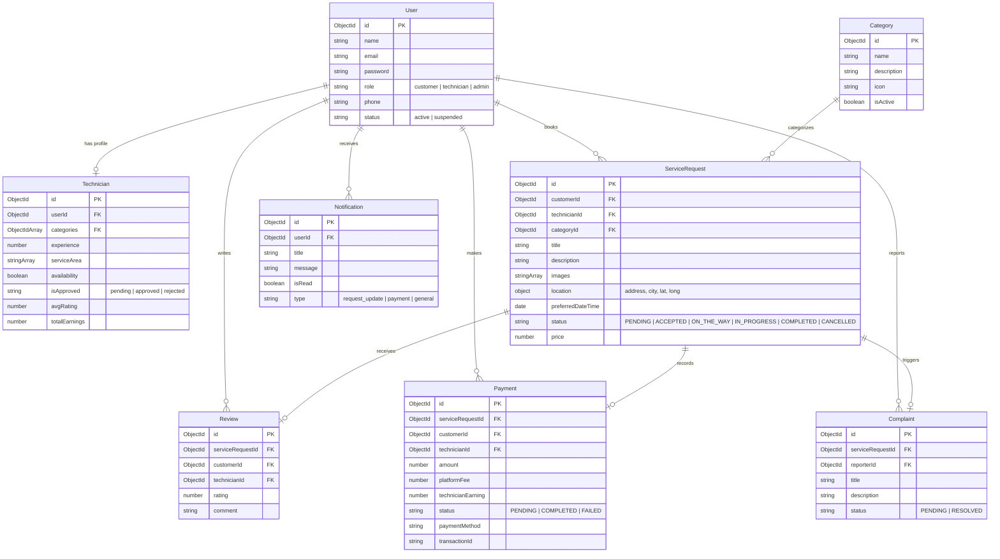

# FixNear — Local Service & Technician Management Platform

FixNear is a production-grade MERN application designed to connect local customers facing domestic or technical issues with verified neighborhood technicians. Integrated with an intelligent troubleshooting assistant, **FixAI**, the platform features role-based workflows for Customers, Technicians, and Administrators.

---

## Technical Stack
- **Frontend**: React (Vite), React Router DOM, Tailwind CSS (v4), Axios, React Hook Form, Recharts, Lucide React icons.
- **Backend**: Node.js, Express, MongoDB (Mongoose ODM), JWT Authentication, bcryptjs, Multer.
- **Database**: 8 relational collections with indexing and constraints.

---

## System Design & Database Models



---

## API Documentation

### Authentication & Profiles
- `POST /api/auth/register`: Create user account (attaches `Technician` profile automatically if signing up as a technician).
- `POST /api/auth/login`: Authenticate credentials, return JWT and user info.
- `GET /api/users/profile`: Query details of the current logged-in user.
- `PUT /api/users/profile`: Update profile info (name, phone, experience, service areas, availability).

### Service Categories
- `GET /api/categories`: Retrieve all active service categories.
- `POST /api/categories` (Admin): Create a new service category.
- `PUT /api/categories/:id` (Admin): Modify service category name or icon.
- `DELETE /api/categories/:id` (Admin): Physical deletion of category.

### Service Requests
- `POST /api/service-requests` (Customer): Place request with up to 5 images.
- `GET /api/service-requests` (Customer): View customer's booking history.
- `GET /api/service-requests/nearby` (Technician): List pending bookings matching category and city service areas.
- `GET /api/service-requests/jobs` (Technician): List all jobs accepted by the technician.
- `GET /api/service-requests/:id`: View detailed breakdown of a single request.
- `PUT /api/service-requests/:id` (Customer): Edit pending booking details.
- `DELETE /api/service-requests/:id` (Customer): Cancel booking.
- `PUT /api/service-requests/:id/status` (Technician): Progress order status: `ACCEPTED` → `ON_THE_WAY` → `IN_PROGRESS` → `COMPLETED`.

### Technician Engagements
- `GET /api/technicians`: Retrieve all technician listings.
- `GET /api/technicians/:id`: Fetch technician profile by ID.
- `POST /api/technicians/:id/accept` (Technician): Accept a service request ID.
- `POST /api/technicians/:id/reject` (Technician): Release/reject an accepted service request.

### Mock Payments
- `POST /api/payments/checkout` (Customer): Complete mock transaction (calculates 10% platform fee, credits 90% to technician profile).
- `GET /api/payments/:serviceRequestId`: Get receipt details for completed bookings.

### FixAI Diagnostics
- `POST /api/ai/diagnose`: Submit problem text. Returns categorized causes, troubleshooting guidelines, severity and recommends category.

### Control Console (Admin)
- `GET /api/admin/dashboard`: Platform overview statistics and aggregations.
- `GET /api/admin/users`: List registered customers.
- `GET /api/admin/technicians`: List technicians.
- `PUT /api/admin/technicians/:id/approve`: Approve or reject technician applications.
- `PUT /api/admin/users/:id/status`: Suspend or reinstate user accounts.
- `DELETE /api/admin/users/:id`: Delete accounts permanently.
- `GET /api/admin/complaints`: List user reported complaints.
- `PUT /api/admin/complaints/:id/resolve`: Resolve reported tickets.

---

## Installation & Running the Application

### Prerequisites
1. **Node.js** (v18+)
2. **npm**
3. **MongoDB** (Extracted folder runs inside the workspace)

### Steps

#### 1. Setup Backend
1. Open a terminal in `fixnear/backend/`.
2. Configure `.env` values (copied from `.env.example`).
3. Seed database:
   ```bash
   npm run seed
   ```
4. Run server:
   ```bash
   npm run dev
   ```
   *(Backend will be active on `http://localhost:5000`)*

#### 2. Setup Frontend
1. Open a terminal in `fixnear/frontend/`.
2. Install packages:
   ```bash
   npm install
   ```
3. Run dev client:
   ```bash
   npm run dev
   ```
   *(Vite will serve page on `http://localhost:5173` with proxying to port 5000)*

---

## Testing Credentials

| Role | Username / Email | Password | Details |
| :--- | :--- | :--- | :--- |
| **Admin** | `admin@fixnear.com` | `Password@123` | Control Panel access |
| **Customer** | `customer1@fixnear.com` | `Password@123` | Booking, payment, reviews |
| **Technician 1** | `tech1@fixnear.com` | `Password@123` | Approved, categories: Laptop/Mobile |
| **Technician 5** | `tech5@fixnear.com` | `Password@123` | Pending Admin Approval (test queue) |
